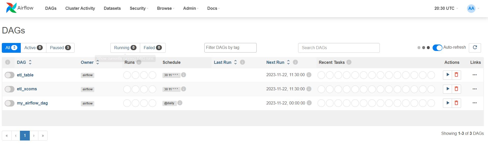
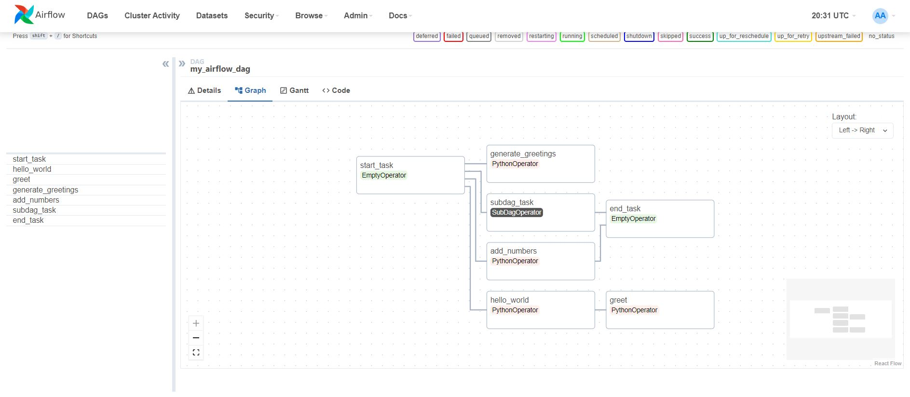

# Airflow 

App that enables the deploy of Machine learning Cycles and ETLs.

Overall, It is presented as a solution for a Data Engineering requiring supporting Python natively

## Why to use it?

Scalable, Replicable in any machine via docker, reliable.

## Software Tools

* Python
* PySpark
* Machine learning and Deep Learning Dependencies

## How to Run?

You may clone the repository and then execute the following comands:

- docker build -f Dockerfile -t 'extending_airflow:latest' .
- docker-compose up

## Contributing
==========
Any kind of contributions are welcome.

1. <a href='https://help.github.com/articles/fork-a-repo/'>**Fork**</a> the repo on GitHub.
2. <a href='https://help.github.com/articles/cloning-a-repository/'>**Clone**</a> the project to your own machine.
3. <a href='https://git-scm.com/book/en/v2/Git-Basics-Recording-Changes-to-the-Repository'>**Commit**</a> changes to <a href='https://git-scm.com/book/en/v2/Git-Branching-Branches-in-a-Nutshell'>**development branch**</a>.
4. <a href='https://help.github.com/articles/pushing-to-a-remote/'>**Push**</a> your work back up to your fork.
5. Submit a <a href='https://help.github.com/articles/about-pull-requests/'>**Pull request**</a> so that i can review your changes
